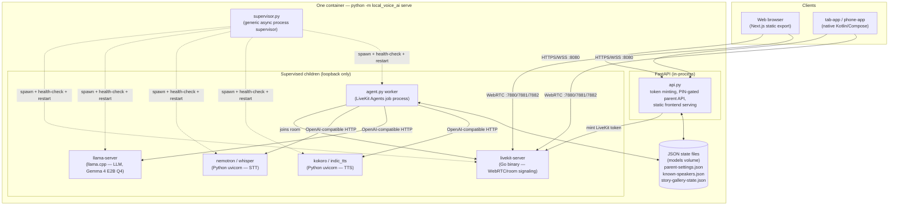

# Architecture

How Story Teller is put together, how a session actually flows end to end,
and why it's built this way rather than the more obvious alternatives. See
[CLAUDE.md](CLAUDE.md) for the file-by-file map and day-to-day dev commands;
this doc is the "why," not the "where."

## System diagram

Every arrow inside the container is plain HTTP/WS over `127.0.0.1` — nothing
in here talks to anything outside the box except the two client-facing
listeners on `:8080` (web/API) and the LiveKit ports (`:7880` signaling,
`:7881` TCP fallback, `:7882/udp` media).

## How a session actually works

1. **Boot.** `python -m local_voice_ai serve` builds a `Config` from env vars
   (`config.py`), turns it into a list of `ChildSpec`s (`__main__.py`), and
   starts `supervisor.py`, which spawns each managed child and polls its
   `ready_url`. The FastAPI app starts *before* children are ready, so
   `/api/status` can serve first-boot download progress instead of a dead
   page.
2. **Picking a character.** The frontend (web or native) shows the three
   characters + language picker, then calls `POST /api/connection-details`.
   `api.py::_mint_token` mints a LiveKit token with the choice (character,
   language, optional custom story/PDF text) embedded as room metadata —
   there's no separate "session config" API call; the room itself carries it.
3. **Joining.** The client connects to `livekit-server` over WebRTC.
   `agent.py::my_agent` is a LiveKit Agents job that's dispatched into that
   room, reads the room metadata back out, and builds an `AgentSession` wired
   to the STT/LLM/TTS children via their OpenAI-compatible HTTP APIs — the
   agent has no idea whether those APIs are local subprocesses or a remote
   provider (see "Design decisions" below).
4. **The turn loop.** Child speaks → VAD/turn-detection decides she's done →
   STT transcribes → (normally) the LLM generates a reply → TTS speaks it.
   `Assistant.llm_node()` (`agent.py`) intercepts this step: a bare "tell me
   a story" with no topic skips the LLM entirely and recites a story from
   `story_examples.md` instead (see "Design decisions" — CPU-saving
   shortcut); anything with a topic, or any other kind of turn, goes through
   the real LLM unchanged.
5. **Side channels running in parallel**, not blocking the turn loop:
   - **Voice recognition** (`speaker_id.py`) taps the same mic track a
     second time to compute a voice embedding per utterance, checks it
     against `known_speakers.py` on the first utterance only, and lets the
     LLM greet a returning child by name.
   - **Server-side time limit** (`_enforce_time_limit`) is a fire-and-forget
     asyncio task that ends the room regardless of what the client does —
     the client's own countdown is cooperative only.
   - **Idle check-in**: native apps send a `check_in` data message after
     their own client-side idle timer; the server prompts a short "still
     there?" line rather than trusting the client's silence detection alone.
6. **Parent dashboard**, a separate flow entirely: PIN-gated REST endpoints
   in `api.py` (time limit, custom story/PDF text, known-speaker
   list/delete), backed by the same JSON-file-on-the-models-volume idiom as
   voice recognition and the story gallery.

## Design decisions

**One supervised process, not microservices.** `supervisor.py` is a generic
async process supervisor with zero project-specific knowledge — it spawns
`ChildSpec`s, health-checks them, restarts crashed ones. There's no
orchestration layer, service mesh, or container-per-service split. For a
single-box, single-tenant, family-network deployment, that overhead buys
nothing; one Python process owning the whole lifecycle is easier to reason
about, easier to ship as one image, and has one log stream.

**OpenAI-compatible HTTP as the only contract between the agent and
inference.** STT/LLM/TTS are each fronted by an OpenAI-compatible API,
whether they're local subprocesses (`nemotron`, `llama-server`, `kokoro`) or
a remote provider. `agent.py` never branches on which — it just calls the
API. This is what makes the "manage" pattern below possible with no code
changes, only env vars.

**The "manage" pattern (`config.py`).** Each service's `*_BASE_URL` decides
whether the supervisor spawns and owns it: loopback → managed subprocess;
anything else → skipped, and the URL is used directly (e.g. pointing
`LLAMA_BASE_URL` at a cloud LLM). `MANAGE_*` env vars override the
auto-detection explicitly. This means the exact same codebase runs fully
offline on a Raspberry-Pi-class box or hybrid (local STT/TTS, cloud LLM) or
fully cloud-backed, with no branching logic anywhere except this one
loopback check.

**Local-first, not local-only-by-policy.** Everything defaults to running on
your own hardware because that's the actual privacy story this project
sells (no conversation audio/transcript ever has to leave the network) — but
it's not hard-locked to local, per the "manage" pattern above, for anyone
who'd rather trade privacy for a bigger cloud model.

**Prompt-only safety, no secondary filter.** There's no moderation API call,
no output classifier, no keyword blocklist between the LLM and TTS —
`characters.py`'s system prompt is the entire safety mechanism (see
`_SHARED_RULES`: no violence/scary content, gentle redirects, simple
language). This is a conscious trade-off documented as a real limitation
(see the README's Disclaimers), not an oversight: adding a second model call
to classify every reply would double the latency and CPU cost of every turn
for a small local LLM that's already the bottleneck, for a use case (family
supervision assumed) where the threat model is "the LLM says something
slightly off," not "the LLM is adversarially prompted by a stranger."

**JSON files on a volume, not a database.** Parent settings, known speakers,
and gallery-story told-counts are each a single small JSON file
(`parent_settings.py`, `known_speakers.py`, `story_gallery_state.py`), all
following the same load/mutate/save-whole-file idiom. None of this data
needs querying, transactions, or concurrent-writer safety beyond "single
agent process, occasional write" — a database would be infrastructure this
project doesn't otherwise have (no DB container, no migrations) for data
that's a handful of records at most.

**Skipping the LLM for generic story requests.** The LLM (`llama-server`) is
the most CPU-expensive step in every turn, especially without a working GPU.
`Assistant.llm_node()` overrides LiveKit Agents' pipeline hook to detect a
bare "tell me a story" (no topic, no constraints — `_is_generic_story_request`)
and, only in that case, skip the LLM and recite a story straight from
`story_examples.md`, prefaced by an in-character line stating (never asking)
that it's a gallery pick rather than a new one. Any topic, constraint, or
other kind of turn (chit-chat, her name, a follow-up question) still goes
through the real LLM unchanged — this is an additive fast path, not a
replacement for generation. Which gallery story gets picked is biased
toward whichever has been told least often *overall*, persisted across
restarts in `story_gallery_state.json`, not just least-often this session,
so a long-running install doesn't lean on the same few stories forever.

**Character personas are data, not a plugin system.** `characters.py`
defines exactly three fixed `Character` dataclasses (id, name, TTS voice,
instructions, intro line) — there's no dynamic character-creation UI or
config format for adding a fourth. For a kid-facing product where
predictability matters more than extensibility, three well-tuned personas
beat an open-ended system a 4-year-old was never going to configure anyway.

**Native apps share code by literal duplication, not a shared library.**
`tab-app` and `phone-app` are two separate Gradle projects with several files
(`Mascot.kt`, `LiveKitManager.kt`, `CallScreen.kt`) copied line-for-line
between them (package name swapped). A shared Gradle module was the more
"correct" option; two small single-purpose apps with occasional manual sync
was judged simpler than standing up multi-module Gradle tooling for a
two-app, single-maintainer project — the trade-off is discipline (port a fix
to both in the same pass), not tooling.
