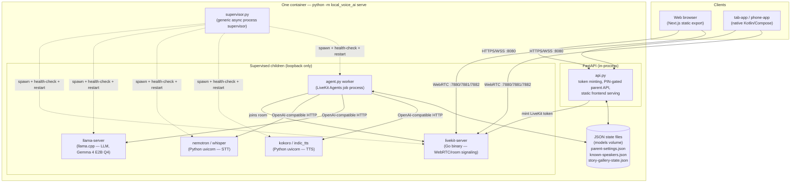

# Architecture

How Story Teller is put together, how a session actually flows end to end,
and why it's built this way rather than the more obvious alternatives. See
[CLAUDE.md](CLAUDE.md) for the file-by-file map and day-to-day dev commands;
this doc is the "why," not the "where."

## System diagram

Every arrow inside the container is plain HTTP/WS over `127.0.0.1` — nothing
in here talks to anything outside the box except the two client-facing
listeners on `:8080` (web/API) and the LiveKit ports (`:7880` signaling,
`:7881` TCP fallback, `:7882/udp` media).

## How a session actually works

1. **Boot.** `serve` builds `Config` from env vars, turns it into `ChildSpec`s (`__main__.py`), starts `supervisor.py`. FastAPI starts *before* children are ready, so `/api/status` serves first-boot download progress instead of a dead page.
2. **Picking a character.** Frontend shows the character/language picker, calls `POST /api/connection-details`. `api.py::_mint_token` mints a LiveKit token with the choice (character, language, optional custom story/PDF) embedded as room metadata — no separate "session config" call; the room carries it.
3. **Joining.** Client connects to `livekit-server` over WebRTC. `agent.py::my_agent` (a LiveKit Agents job) reads the room metadata, builds an `AgentSession` wired to STT/LLM/TTS via OpenAI-compatible HTTP — agnostic to local-subprocess vs. remote provider (see Design decisions).
4. **The turn loop.** Speak → VAD/turn-detection → STT → LLM reply → TTS. `Assistant.llm_node()` intercepts: a bare "tell me a story" (no topic) skips the LLM and recites from `story_examples.md`; anything with a topic, or any other turn, goes through the real LLM unchanged.
5. **Side channels, running in parallel, not blocking the turn loop:**
   - **Voice recognition** (`speaker_id.py`): taps the mic a second time per utterance, checks the embedding against `known_speakers.py` on the first utterance only, lets the LLM greet a returning child by name.
   - **Server-side time limit** (`_enforce_time_limit`): fire-and-forget asyncio task, ends the room regardless of the client — the client's countdown is cooperative only.
   - **Idle check-in**: native apps send a `check_in` data message after their own idle timer; the server prompts a short "still there?" rather than trusting client-side silence detection alone.
6. **Parent dashboard**, a separate flow: PIN-gated REST endpoints in `api.py` (time limit, custom story/PDF, known-speaker list/delete), same JSON-on-volume idiom as voice recognition and the story gallery.

## Design decisions

- **One supervised process, not microservices.** `supervisor.py` spawns, health-checks, and restarts `ChildSpec`s with zero project-specific knowledge — no orchestration layer, mesh, or per-service containers.
  - Why: a single-box, single-tenant, family-network deployment gets nothing from that overhead. One process → one image, one log stream, easier to reason about.

- **OpenAI-compatible HTTP is the only agent↔inference contract.** STT/LLM/TTS are each fronted by an OpenAI-compatible API, local subprocess or remote provider alike — `agent.py` never branches on which.
  - Enables the "manage" pattern below with zero code changes, env vars only.

- **The "manage" pattern (`config.py`).** Each service's `*_BASE_URL` decides ownership: loopback → supervisor spawns/owns the subprocess; anything else → skipped, URL used directly (e.g. `LLAMA_BASE_URL` pointed at a cloud LLM). `MANAGE_*` env vars override the auto-detection.
  - Same codebase runs fully offline, hybrid (local STT/TTS + cloud LLM), or fully cloud-backed — no branching beyond this one loopback check.

- **Local-first, not local-only-by-policy.** Defaults to local hardware because that's the actual privacy story (no audio/transcript ever leaves the network) — not hard-locked, per the "manage" pattern, for anyone trading privacy for a bigger cloud model.

- **Prompt-only safety, no secondary filter.** `characters.py`'s system prompt (`_SHARED_RULES`) is the entire safety mechanism — no moderation call, output classifier, or keyword blocklist between LLM and TTS.
  - Deliberate trade-off (see README Disclaimers), not an oversight: a second model call to classify every reply would double latency/CPU on an already-bottlenecked local LLM, for a threat model of "the LLM says something slightly off" under assumed family supervision — not adversarial prompting.

- **JSON files on a volume, not a database.** Parent settings, known speakers, and gallery-story told-counts are each a single small JSON file (`parent_settings.py`, `known_speakers.py`, `story_gallery_state.py`), same load/mutate/save-whole-file idiom.
  - No querying, transactions, or concurrent-writer safety needed beyond "single agent process, occasional write" — a DB would be infrastructure this project doesn't otherwise have, for a handful of records.

- **Skipping the LLM for generic story requests.** `Assistant.llm_node()` overrides LiveKit Agents' pipeline hook: a bare "tell me a story" (no topic — `_is_generic_story_request`) skips `llama-server` and recites one from `story_examples.md` instead, prefaced by a stated (never asked) gallery-pick line. Any topic/constraint/other turn still hits the real LLM — additive fast path, not a replacement for generation.
  - Picks are weighted toward whichever story's been told least often *overall*, persisted across restarts (`story_gallery_state.json`), not just this session.

- **Character personas are data, not a plugin system.** `characters.py` defines exactly three fixed `Character` dataclasses — no dynamic character-creation UI or config format.
  - For a kid-facing product, predictability beats extensibility a 4-year-old was never going to configure anyway.

- **Native apps share code by literal duplication, not a shared library.** `tab-app`/`phone-app` are separate Gradle projects with `Mascot.kt`/`LiveKitManager.kt`/`CallScreen.kt` copied line-for-line (package name swapped).
  - Two small single-purpose apps with manual sync was simpler than multi-module Gradle tooling for a two-app, single-maintainer project — the trade-off is discipline (port fixes to both), not tooling.
